# AI Image Reminders - System Architecture

```mermaid
graph TB
    %% External Systems
    subgraph "External Systems"
        CAM1[Kitchen Camera<br/>camera.ca_kitchen]
        CAM2[Family Room Camera<br/>camera.ca_family_room]
        CAM3[Driveway Camera<br/>camera.ca_driveway]
        GEMINI[Google Gemini AI<br/>AI Tasks Integration]
        NOTIFY[UNotify Service<br/>Parent Notifications]
        MOTION[Motion Sensors<br/>Trigger Events]
    end

    %% Core AI Processing Layer
    subgraph "AI Processing Layer"
        AITASK[AI Tasks Engine<br/>Home Assistant 2025.8.0]
        AIPROC[Image Analysis<br/>Processor]
    end

    %% Sensor Layer
    subgraph "Template Sensors"
        KA[Kitchen Analysis<br/>sensor.kitchen_analysis]
        FA[Family Room Analysis<br/>sensor.family_room_analysis]
        DA[Dog Walk Detection<br/>sensor.dog_walk_detection]
        KS[Kitchen Status<br/>sensor.kitchen_cleanliness_status]
        FS[Family Room Status<br/>sensor.family_room_cleanliness_status]
        DS[Dog Walk Status<br/>sensor.dog_walk_status]
        TS[Time Sensors<br/>Time since last events]
    end

    %% Control Layer
    subgraph "Helper Entities"
        subgraph "Input Boolean Controls"
            IB1[System Enable/Disable]
            IB2[Monitoring Controls]
            IB3[Notification Controls]
            IB4[Manual Overrides]
        end
        
        subgraph "Input DateTime Tracking"
            IDT1[Last Check Times]
            IDT2[Walk Completion Times]
            IDT3[Notification History]
        end
        
        subgraph "Input Number Thresholds"
            IN1[Cleanliness Thresholds]
            IN2[Time Limits]
            IN3[Notification Cooldowns]
        end
        
        subgraph "Input Text Configuration"
            IT1[Camera Entity IDs]
            IT2[Notification Services]
        end
    end

    %% Logic Layer
    subgraph "Automation Logic"
        subgraph "Kitchen Monitoring"
            KM1[Kitchen Cleanup Detection]
            KM2[Kitchen Notifications]
            KM3[Kitchen Acknowledgments]
        end
        
        subgraph "Family Room Monitoring"
            FM1[Family Room Detection]
            FM2[Family Room Notifications]
            FM3[Family Room Acknowledgments]
        end
        
        subgraph "Dog Walk System"
            DM1[Walk Detection Logic]
            DM2[Walk Reminders]
            DM3[Walk Tracking]
        end
        
        subgraph "Notification System"
            NM1[Daily Summaries]
            NM2[System Health Checks]
            NM3[Emergency Overrides]
            NM4[Quiet Hours Management]
        end
    end

    %% Template Message Layer
    subgraph "Message Templates"
        MT1[Kitchen Messages<br/>Positive & Escalation]
        MT2[Family Room Messages<br/>Reminder & Acknowledgment]
        MT3[Dog Walk Messages<br/>Reminder & Escalation]
        MT4[System Messages<br/>Daily & Weekly Reports]
    end

    %% Data Flow Connections
    CAM1 --> AITASK
    CAM2 --> AITASK
    CAM3 --> AITASK
    AITASK --> GEMINI
    GEMINI --> AIPROC
    
    AIPROC --> KA
    AIPROC --> FA
    AIPROC --> DA
    
    KA --> KS
    FA --> FS
    DA --> DS
    
    KS --> TS
    FS --> TS
    DS --> TS
    
    %% Control Flow
    IB1 --> KM1
    IB2 --> FM1
    IB3 --> DM1
    IB4 --> NM1
    
    IDT1 --> TS
    IDT2 --> TS
    IDT3 --> TS
    
    IN1 --> KS
    IN1 --> FS
    IN2 --> DS
    IN3 --> NM1
    
    IT1 --> AITASK
    IT2 --> NOTIFY
    
    %% Automation Triggers
    KS --> KM1
    FS --> FM1
    DS --> DM1
    MOTION --> KM1
    MOTION --> FM1
    MOTION --> DM1
    
    %% Message Generation
    KM2 --> MT1
    FM2 --> MT2
    DM2 --> MT3
    NM1 --> MT4
    
    %% Output
    MT1 --> NOTIFY
    MT2 --> NOTIFY
    MT3 --> NOTIFY
    MT4 --> NOTIFY
    
    %% Styling
    classDef camera fill:#e1f5fe,stroke:#01579b,stroke-width:2px
    classDef ai fill:#f3e5f5,stroke:#4a148c,stroke-width:2px
    classDef sensor fill:#e8f5e8,stroke:#1b5e20,stroke-width:2px
    classDef control fill:#fff3e0,stroke:#e65100,stroke-width:2px
    classDef automation fill:#fce4ec,stroke:#880e4f,stroke-width:2px
    classDef message fill:#f1f8e9,stroke:#33691e,stroke-width:2px
    classDef external fill:#ffebee,stroke:#b71c1c,stroke-width:2px
    
    class CAM1,CAM2,CAM3 camera
    class GEMINI,AITASK,AIPROC ai
    class KA,FA,DA,KS,FS,DS,TS sensor
    class IB1,IB2,IB3,IB4,IDT1,IDT2,IDT3,IN1,IN2,IN3,IT1,IT2 control
    class KM1,KM2,KM3,FM1,FM2,FM3,DM1,DM2,DM3,NM1,NM2,NM3,NM4 automation
    class MT1,MT2,MT3,MT4 message
    class NOTIFY,MOTION external
```

## System Components Overview

### 🎥 **Data Input Layer**
- **Security Cameras**: Capture real-time images from kitchen, family room, and driveway
- **Motion Sensors**: Trigger analysis events and automation workflows
- **Manual Controls**: Allow parent override and manual system control

### 🤖 **AI Processing Layer**
- **AI Tasks Engine**: Home Assistant 2025.8.0 native AI processing
- **Google Gemini Integration**: Advanced image analysis and context understanding
- **Image Analysis Pipeline**: Processes camera feeds for cleanliness and activity detection

### 📊 **Sensor Layer**
- **Analysis Sensors**: Raw AI analysis results from each camera
- **Status Sensors**: Interpreted cleanliness and activity states
- **Time Tracking**: Duration since last cleaning/walking events
- **Confidence Scoring**: AI analysis confidence levels

### ⚙️ **Control Layer**
- **Boolean Controls**: Enable/disable monitoring and notifications
- **DateTime Tracking**: Historical event timestamps
- **Numeric Thresholds**: Configurable sensitivity and timing parameters
- **Text Configuration**: Dynamic entity and service configuration

### 🔄 **Automation Layer**
- **Event Detection**: Monitors sensor state changes
- **Logic Processing**: Applies business rules and timing logic
- **Escalation Management**: Handles progressive notification strategies
- **System Health**: Monitors AI service availability and performance

### 💬 **Message Layer**
- **Template Engine**: Dynamic message generation based on context
- **Escalation Messages**: Progressive urgency in notifications
- **Positive Reinforcement**: Acknowledgment and praise messages
- **System Reports**: Daily summaries and weekly analytics

### 📱 **Output Layer**
- **UNotify Integration**: Delivers messages to parent devices
- **Quiet Hours Management**: Respects family schedules
- **Emergency Override**: Critical notifications bypass quiet hours

## Key Architectural Principles

### 🏗️ **Modular Design**
- Separate concerns: detection, logic, messaging, delivery
- Loosely coupled components for maintainability
- Configuration-driven behavior

### 🛡️ **Robust Error Handling**
- Graceful degradation when AI services unavailable
- Template safety for missing sensor data
- Fallback messaging when primary services fail

### 📈 **Scalable Configuration**
- Easily add new cameras or monitoring areas
- Configurable thresholds without code changes
- Dynamic service endpoint configuration

### 🔄 **Event-Driven Architecture**
- Reactive system responds to state changes
- Minimal polling, maximum efficiency
- Real-time processing with appropriate delays
